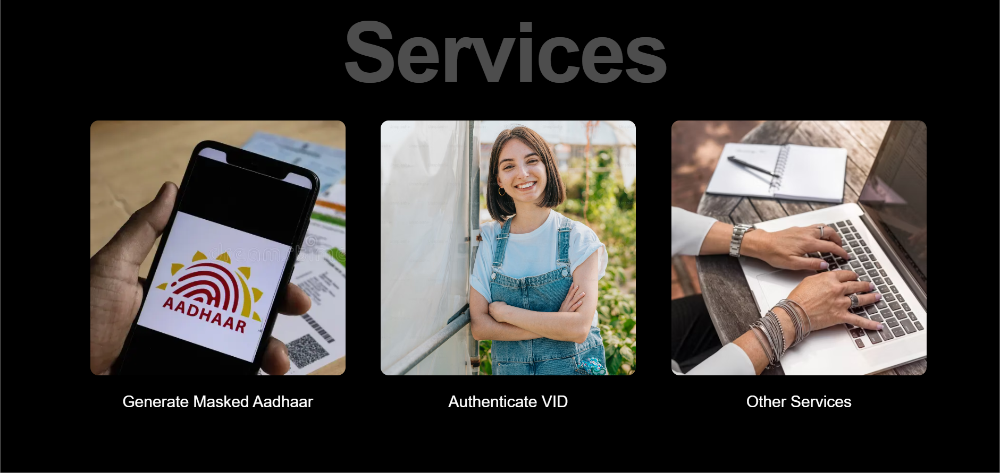
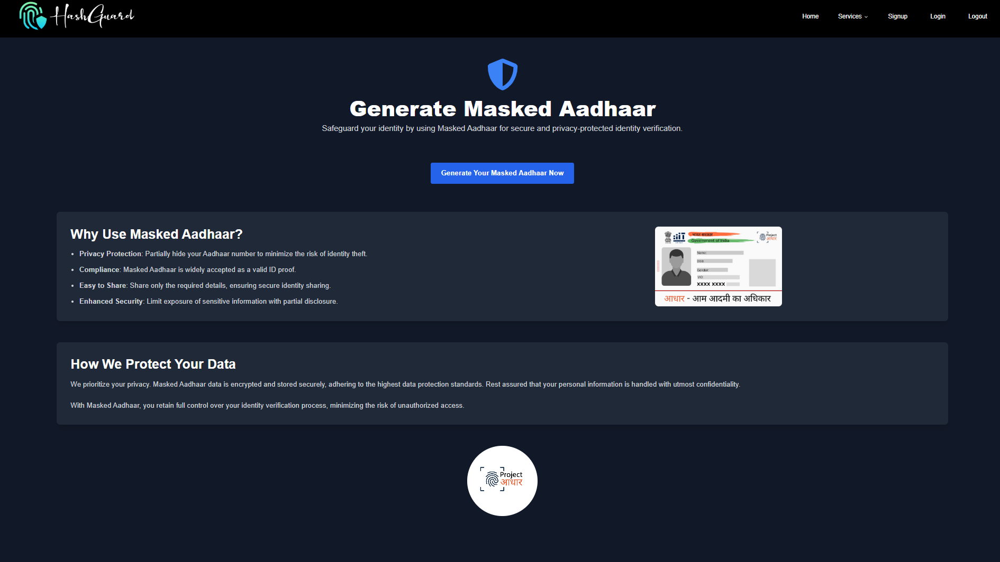

**HashGuard’s Project आधार**

  The website is live at :
  <a href="https://hashguard.vercel.app" target="_blank" style="font-size: 1.5rem; color: #3D52A0; font-weight: bold; text-decoration: none;">
    hashguard.vercel.app
  </a>

### **Team Members**
- **Rudra Pandya**
- **Omkar Lakhute**
- **Arya Sali**
- **Shreyas Kadge**

### **Project Status** 
Concluded

### **Brief on Masked Aadhaar Card**

**What is a Masked Aadhaar Card?** A masked Aadhaar card is a version of the Aadhaar card where the first eight digits of the Aadhaar number are hidden or obscured and a VID is given instead. Only the last four digits are visible, ensuring a layer of privacy and security.

### **Project Overview & website preview:**

This project is designed to provide a secure identity management system based on the Aadhaar number, using a Virtual ID (VID) for authentication.

### **How It Works:**

1. **User Registration:**  
   * Users register with their Aadhaar number and email ID. The Aadhaar number is securely stored (hashed/encrypted). 

   

      
   

2. **VID Generation:**  
   * Users can generate a unique VID after verifying their identity through an OTP sent to their registered email. This VID can be used instead of the Aadhaar number for authentication.

   

   
   
  

3. **Masked Aadhaar Generation and sent via gmail:**  
   * An Aadhaar-like image is created, displaying the user’s photo (if uploaded) and optional details (address, DOB, etc.), along with the masked Aadhaar number and VID number

   

      
   

4. **Authentication:**  
   * Users authenticate using their VID, requiring another OTP verification for added security. A voice CAPTCHA may also be implemented for further verification.

   

      
   
  
   

      
   
  

5. **VID Retrieval/Replacement:**  
   * Users can retrieve or replace their VID as needed, again using OTP verification to ensure security.  
6. **Security Measures:**  
   * The system employs post-quantum cryptography for secure data handling and logs all actions for auditing and consent management.

This project aims to enhance privacy and security in identity management while providing a user-friendly experience.

**Uses of Masked Aadhaar Card:**

* **Identity Verification:** Used for identity verification in various services without exposing the full Aadhaar number.  
* **KYC Compliance:** Helps meet Know Your Customer (KYC) requirements while protecting personal information.  
* **Secure Transactions:** Facilitates secure transactions in banking, mobile services, and online platforms.

**Where is it Useful?**

* **Financial Services:** Banks and financial institutions often require identity proof while maintaining customer confidentiality.  
* **Online Services:** E-commerce and online platforms use it for user verification while ensuring data privacy.  
* **Government Services:** Useful for availing government schemes that require Aadhaar authentication.

The masked Aadhaar number (xxxx-xxxx-1234) serves a privacy role rather than a verification role, meaning it’s not intended for official validation but rather for user familiarity and security during interactions within the app.  
The masked Aadhaar number is mainly for display purposes to protect the full Aadhaar number from being exposed directly.  
Users can still recognize their Aadhaar without compromising its security (only the last 4 digits are shown). This reassures users that the VID, for instance, is associated with their own Aadhaar record.  
Enhanced User Security:

By masking the Aadhaar in user-facing views (e.g., profile, dashboard, emails), it ensures only part of the Aadhaar number is visible in case of accidental exposure.  
This aligns with privacy regulations and follows UIDAI’s masking standards for safely displaying Aadhaar information without revealing it fully.  
Consistency with Official Guidelines:

UIDAI itself recommends masking Aadhaar numbers in digital and physical displays when the full number is not required, following a practice used in banking and secure systems where only partial identifiers are shown.

When the VID is generated or requested, it’s mapped internally to the full Aadhaar (not shown externally).  
Authentication using the VID allows users to verify their identity without needing to display or directly reference their full Aadhaar.  
Briefly, the masked Aadhaar number is primarily a privacy display mechanism rather than a means of validation, making it useful for non-sensitive views within the app.

## 👏 Contributors

This project exists thanks to all the people who contribute.

  

---
